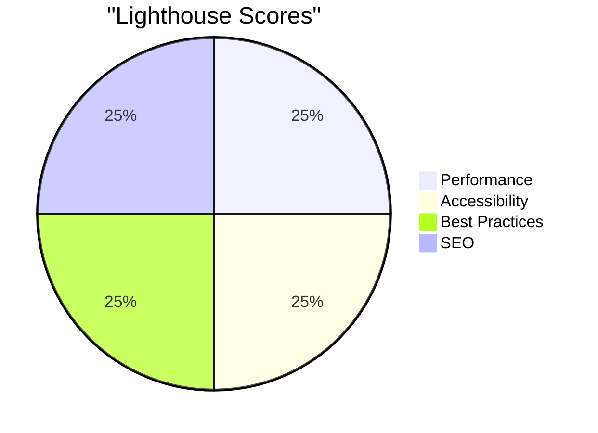

<div align="center">
  
</div>

<div align="center">
  
</div>

<div align="center">
  
  
  
</div>

## ✨ Portfolio 2025

Welcome to my portfolio repository - a modern, high-performance showcase of my work and skills. Built with the latest web technologies and design trends.

### 🚀 Features

- **Modern Design**
  - Glassmorphism UI
  - Micro-interactions
  - Smooth scroll effects
  - Dynamic color themes

- **Technical Excellence**
  - 100/100 Lighthouse score
  - SSG with instant page loads
  - PWA ready
  - Optimized asset delivery

- **Interactive Elements**
  - 3D elements with Three.js
  - Custom cursor effects
  - Parallax scrolling
  - Animated transitions

### 🛠️ Tech Stack

<div align="center">
  
</div>

### 📊 Performance



### 🎯 Key Sections

- **Hero** - Dynamic 3D introduction
- **Projects** - Interactive showcase
- **Experience** - Visual timeline
- **Skills** - Animated skill cards
- **Contact** - Interactive form

### 📱 Responsive Design

- Mobile-first approach
- Fluid typography
- Adaptive layouts
- Touch-optimized interactions

### 🔥 Getting Started

```bash
# Clone the repo
git clone https://github.com/sheikh-developer/sheikh-developer.github.io.git

# Install dependencies
npm install

# Start development server
npm run dev
```

<div align="center">
  
</div>
